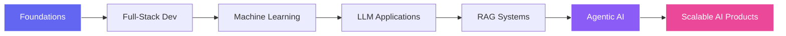

<!-- ====================== HERO SECTION ====================== -->
<div align="center">

<a href="https://github.com/harshraj677">
  
</a>

<!-- Animated Typing SVG -->
<a href="https://github.com/harshraj677">
  
</a>

<br/>

<!-- Tagline --->
<p>
  <em>Building intelligent systems and scalable products — turning ideas into real-world impact.</em>
</p>

<!-- Profile Counters & Badges --->
<p>
  
  <a href="https://github.com/harshraj677?tab=followers">
    
  </a>
  <a href="https://github.com/harshraj677?tab=repositories">
    
  </a>
</p>

<!-- Social Quick Links -->
<p>
  <a href="https://www.linkedin.com/in/harsh-raj-697858228">
    
  </a>
  <a href="mailto:rajharsh7070@gmail.com">
    
  </a>
  <a href="https://github.com/harshraj677">
    
  </a>
</p>

</div>

<br/>

<!-- ====================== ABOUT ME ====================== -->


## &nbsp;About Me

> I'm a **Software & AI Engineer** who loves transforming complex problems into clean, scalable solutions.

- 🤖 I **build AI-powered applications** that solve real-world problems end-to-end.
- ⚙️ I enjoy **backend engineering** — designing robust APIs, services, and architectures.
- 🧠 I'm deeply exploring **Agentic AI systems** and multi-agent workflows.
- 🔎 I'm learning **Retrieval-Augmented Generation (RAG)** and context engineering.
- 📈 I have a strong interest in **Machine Learning** and am growing in **Data Science & Analytics**.
- 🚀 My goal: **create impactful, scalable products** that people actually love to use.

<br/>

```python
class HarshRaj:
    def __init__(self):
        self.role        = ["Software Engineer", "AI Engineer", "Full-Stack Developer"]
        self.focus       = ["Agentic AI", "RAG Systems", "LLM Applications"]
        self.learning    = ["Data Science", "Data Analytics", "System Design"]
        self.mindset     = "Solve real problems. Ship scalable products."

    def current_goal(self):
        return "Build intelligent systems, one commit at a time 🚀"
```

<br/>

<!-- ====================== CURRENT FOCUS ===================== -->
## 🎯 Current Focus

<table>
  <tr>
    <td valign="top" width="33%">

### 🤖 Agentic AI
- AI agents
- Multi-agent workflows
- Automation systems

</td>
    <td valign="top" width="33%">

### 🔎 RAG Systems
- Vector databases
- Embeddings
- Retrieval pipelines
- Context engineering

</td>
    <td valign="top" width="33%">

### 🌐 Full-Stack Dev
- React
- Node.js
- APIs
- Backend architecture

</td>
  </tr>
  <tr>
    <td valign="top" width="33%">

### 📊 Data Science
- Python
- Pandas
- NumPy
- Data Visualization

</td>
    <td valign="top" width="33%">

### 📈 Data Analytics
- SQL
- Power BI
- Tableau
- Business insights

</td>
    <td valign="top" width="33%">

### 🧠 Machine Learning
- Supervised models
- Model evaluation
- Feature engineering
- Scikit-Learn

</td>
  </tr>
</table>

<br/>

<!-- ====================== TECH STACK ====================== -->
## 🛠️ Tech Stack

<div align="center">

**Languages**


**Frontend**


**Backend**


**Data Science**


**Data Analytics**


**Databases**


**Tools**


</div>

<br/>

<!-- ====================== AI DOMAINS ====================== -->
## 🤖 AI Domains

<div align="center">


</div>

<br/>

<!-- ====================== LEARNING JOURNEY ====================== -->
## 📚 Currently Learning

<table>
  <tr>
    <td>🧩 <b>Agentic AI Architectures</b></td>
    <td>🔗 <b>LangChain</b></td>
    <td>👥 <b>CrewAI</b></td>
  </tr>
  <tr>
    <td>🔎 <b>RAG Pipelines</b></td>
    <td>🗂️ <b>Vector Databases</b></td>
    <td>📊 <b>Data Science</b></td>
  </tr>
  <tr>
    <td>📈 <b>Data Analytics</b></td>
    <td>🧠 <b>Machine Learning</b></td>
    <td>🏛️ <b>System Design</b></td>
  </tr>
  <tr>
    <td>⚙️ <b>Scalable Backend Systems</b></td>
    <td colspan="2"></td>
  </tr>
</table>



<br/>

<!-- ====================== GITHUB ANALYTICS ====================== -->
## 📊 GitHub Analytics

<div align="center">


<br/>


<br/><br/>


<br/><br/>


</div>

<br/>

<!-- ====================== FEATURED PROJECTS ====================== -->
## 🚀 Featured Projects

<table>
  <tr>
    <td width="50%" valign="top">

### 🤖 AI Projects
> Agentic AI & LLM-powered applications.

[](https://github.com/harshraj677)

- 🧠 Multi-agent automation system
- 🔎 RAG-based knowledge assistant
- ⚡ LLM workflow orchestration

<sub>🔧 *More AI projects coming soon...*</sub>

</td>
    <td width="50%" valign="top">

### 🌐 Full-Stack Projects
> End-to-end web apps with React & Node.

[](https://github.com/harshraj677)

- 🖥️ Full-stack web platform
- 🔌 REST API services
- 🗄️ Scalable backend architecture

<sub>🔧 *More full-stack projects coming soon...*</sub>

</td>
  </tr>
  <tr>
    <td width="50%" valign="top">

### 📊 Data Analytics Projects
> Insights, dashboards & business intelligence.

[](https://github.com/harshraj677)

- 📈 Interactive Power BI dashboards
- 🧮 SQL-driven data analysis
- 📊 Tableau visualizations

<sub>🔧 *More analytics projects coming soon...*</sub>

</td>
    <td width="50%" valign="top">

### 🧠 Machine Learning Projects
> Predictive models & ML pipelines.

[](https://github.com/harshraj677)

- 🔮 Predictive ML models
- 🛠️ Feature engineering pipelines
- 📐 Model evaluation & tuning

<sub>🔧 *More ML projects coming soon...*</sub>

</td>
  </tr>
</table>

<details>
  <summary>📌 <b>How my repositories are organized</b></summary>
  <br/>
  <p>I structure my work around four pillars — <b>AI</b>, <b>Full-Stack</b>, <b>Data Analytics</b>, and <b>Machine Learning</b>. Pinned repositories on my profile showcase the most representative work from each area. Each project includes a README with setup steps, architecture notes, and the problem it solves.</p>
</details>

<br/>

<!-- ====================== ACHIEVEMENTS / GOALS ====================== -->
## 🏆 Goals for 2026

<table>
  <tr>
    <td>✅ Build AI-powered applications</td>
    <td>✅ Learn Agentic AI systems</td>
  </tr>
  <tr>
    <td>✅ Master RAG architectures</td>
    <td>✅ Improve System Design</td>
  </tr>
  <tr>
    <td>✅ Explore Data Science</td>
    <td>✅ Strengthen Data Analytics skills</td>
  </tr>
  <tr>
    <td>✅ Contribute to Open Source</td>
    <td>✅ Build impactful products</td>
  </tr>
</table>

<br/>

<!-- ====================== CONNECT ====================== -->
## 🤝 Connect With Me

<div align="center">

<a href="https://www.linkedin.com/in/harsh-raj-697858228">
  
</a>
&nbsp;
<a href="mailto:rajharsh7070@gmail.com">
  
</a>
&nbsp;
<a href="https://github.com/harshraj677">
  
</a>

<br/><br/>

<i>💬 Open to collaboration on AI, Agentic systems, and full-stack projects. Let's build something impactful!</i>

</div>

<br/>

<!-- ====================== FOOTER ====================== -->
<div align="center">


<sub>⭐ From <a href="https://github.com/harshraj677">harshraj677</a> — thanks for visiting!</sub>

</div>
